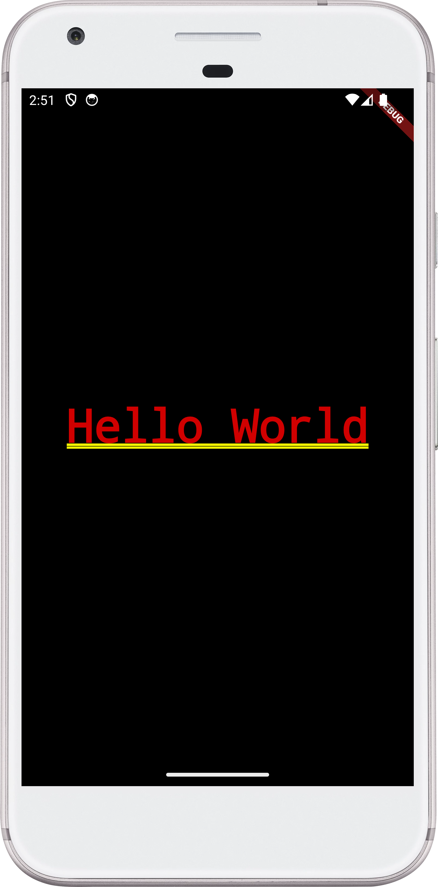

# Learn Flutter By Example

Learn flutter by example

## Projects

|                                               Project                                                |                                   Preview                                   |
| :--------------------------------------------------------------------------------------------------: | :-------------------------------------------------------------------------: |
| [1. Hello World](https://github.com/yasersharifi/flutter-by-example/blob/main/hello_world/README.md) |  |
