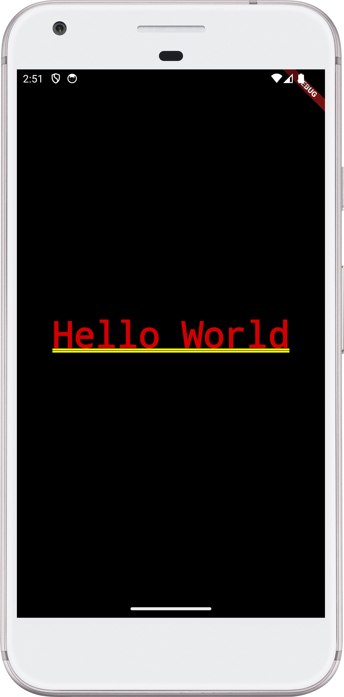

# Hello World Flutter App

This is a basic Flutter application that displays "Hello World" on the screen using the MaterialApp widget.

## 📌 Code Overview

```dart
  // Step1: import the material package
  import "package:flutter/material.dart";

  // Step2: Create the main function
  void main() => runApp(
    MaterialApp(
      title: 'Hello World Application',
      home: Center(child: Text('Hello World')),
    ),
  );

```

## 🚀 How It Works

-   The `main()` function is the entry point of the application.
-   The `runApp()` method starts the Flutter app and takes a `MaterialApp` as an argument.
-   The `MaterialApp` contains:
    -   A `title` for the app.
    -   A `home` widget displaying a Center widget with a Text widget inside.
-   The app simply displays "Hello World" in the center of the screen.

## 🏃‍♂️ Running the Code

1. Install Flutter by following the official guide: Flutter Installation
2. Create a new Flutter project or use an existing one.
3. Replace the main.dart file with the code above.
4. Run the project using:

```shell
  flutter run
```

## Preview

<div style="max-width: 300px">
  
</div>
