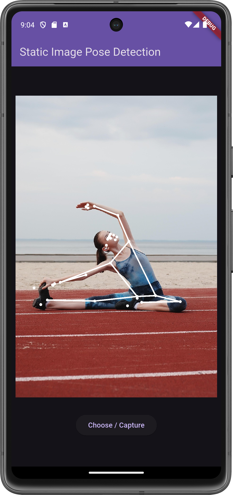

# 🧍‍♂️ Flutter Static Image Pose Detection App with ML Kit

This document explains the implementation of a Flutter-based pose detection application using the `google_mlkit_pose_detection` package.

---

## 📦 Dependencies

```yaml
dependencies:
    flutter:
        sdk: flutter
    google_mlkit_pose_detection: ^0.6.0
    image_picker: ^1.0.4
```

---

## 🚀 Overview

The app allows users to select an image from their gallery or capture one with the camera.
It then runs pose detection using Google's ML Kit and overlays detected pose landmarks and connections on the image.

The ML Kit Pose Detection API is a lightweight versatile solution for app developers to detect the pose of a subject's body in real time from a continuous video or static image. A pose describes the body's position at one moment in time with a set of skeletal landmark points. The landmarks correspond to different body parts such as the shoulders and hips. The relative positions of landmarks can be used to distinguish one pose from another.

ML Kit Pose Detection produces a full-body 33 point skeletal match that includes facial landmarks (ears, eyes, mouth, and nose) and points on the hands and feet. Figure 1 below shows the landmarks looking through the camera at the user, so it's a mirror image. The user's right side appears on the left of the image:

<div style="margin-top: 12px;margin-bottom: 24px;border-radius: 8px;display: flex;flex-direction: column;gap: 26px;align-items:center">
  
  
</div>

ML Kit Pose Detection doesn't require specialized equipment or ML expertise in order to achieve great results. With this technology developers can create one of a kind experiences for their users with only a few lines of code.

The user's face must be present in order to detect a pose. Pose detection works best when the subject’s entire body is visible in the frame, but it also detects a partial body pose. In that case the landmarks that are not recognized are assigned coordinates outside of the image.

---

## 📸 Features

-   Image selection from gallery or camera
-   On-device pose detection using ML Kit
-   Custom painting of landmarks and pose connections
-   Real-time drawing of arms, body, and legs with left/right distinction

---

## Requirements

-   Get `google_mlkit_pose_detection` and `image-picker` Requirements.

---

## 🧩 Code Structure

### `main.dart`

#### Imports Required

```dart
import 'dart:io';
import 'package:flutter/material.dart';
import 'package:google_mlkit_pose_detection/google_mlkit_pose_detection.dart';
import 'package:image_picker/image_picker.dart';
```

#### Key Widgets and Classes

-   **`MyApp`** – Main app root
-   **`MyHomePage`** – Stateful widget handling image selection and pose detection
-   **`PosePainter`** – CustomPainter to draw pose landmarks and connections

#### Pose Detection Flow

1. User taps button to select or capture image
2. Image is passed to ML Kit's `PoseDetector`
3. Landmarks are printed and passed to a custom painter
4. Canvas is drawn with detected points and lines

#### Drawing Logic

-   Landmarks are drawn as small circles
-   Connections are drawn using `drawCustomLine`
-   Separate paints for left and right sides for visual clarity

---

## 📋 Permissions

### Android

```xml
<uses-permission android:name="android.permission.CAMERA"/>
<uses-permission android:name="android.permission.READ_EXTERNAL_STORAGE"/>
```

### iOS

```xml
<key>NSCameraUsageDescription</key>
<string>Camera access is required to take pictures.</string>
<key>NSPhotoLibraryUsageDescription</key>
<string>Photo library access is required to choose images.</string>
```

---

## 📌 Notes

-   The `PoseDetectorOptions` uses the **accurate** model in **single** mode.
-   Landmarks include coordinates and types (e.g., nose, wrist).
-   Use long press on the button to trigger camera input.

---

## ✅ Final Output

The result is an interactive pose detection Flutter app that visualises body keypoints and connections on selected or captured images.

### The app gives a neat interface where users can:

-   Select or capture a photo
-   Automatically detect human pose
-   View

---

## Preview

<div style="background-color: white; display: flex; padding: 10px; border-radius: 8px;display: flex;flex-direction: row;gap: 8px;">
  
  
</div>

---

## Full Application Code

```dart
import 'dart:io';

import 'package:flutter/material.dart';
import 'package:google_mlkit_pose_detection/google_mlkit_pose_detection.dart';
import 'package:image_picker/image_picker.dart';

void main() {
  runApp(const MyApp());
}

class MyApp extends StatelessWidget {
  const MyApp({super.key});

  // This widget is the root of your application.
  @override
  Widget build(BuildContext context) {
    return MaterialApp(
      title: 'Flutter Demo',
      theme: ThemeData(
        colorScheme: ColorScheme.fromSeed(seedColor: Colors.deepPurple),
      ),
      home: const MyHomePage(title: 'Pose detection App - Raadco'),
    );
  }
}

class MyHomePage extends StatefulWidget {
  const MyHomePage({super.key, required this.title});

  final String title;

  @override
  State<MyHomePage> createState() => _MyHomePageState();
}

class _MyHomePageState extends State<MyHomePage> {
  File? _image; // The selected image from gallery or camera.
  late ImagePicker imagePicker; // Used to pick/capture images.
  late PoseDetector poseDetector; // ML Kit's object to detect poses.
  dynamic image; // Holds the decoded image (to draw on canvas).
  List<Pose> poses = []; // List of detected poses (Usually just one per image).

  @override
  void initState() {
    super.initState();

    imagePicker = ImagePicker(); // Initialize the image picker

    final options = PoseDetectorOptions(
      model: PoseDetectionModel.accurate,
      mode: PoseDetectionMode.single, // Pose detector in single image mode.
    );
    poseDetector = PoseDetector(options: options); // Initialize the pose detector with accurate model in single image mode.
  }

  _chooseImage() async {
    // Pick image from gallery
    XFile? selectedImage = await imagePicker.pickImage(
      source: ImageSource.gallery,
    );

    if (selectedImage != null) {
      _image = File(selectedImage.path); // Convert to File
      _doPoseDetection();
    }
  }

  _captureImage() async {
    XFile? selectedImage = await imagePicker.pickImage(
      source: ImageSource.camera,
    );

    if (selectedImage != null) {
      _image = File(selectedImage.path);
      _doPoseDetection();
    }
  }

  _doPoseDetection() async {
    _drawPose();
    InputImage inputImage = InputImage.fromFile(_image!); // Converts the image into an `InputImage` format

    poses = await poseDetector.processImage(inputImage); // Runs pose detection using ML Kit.
    setState(() {
      poses;
    });

    setState(() {
      _image;
    });
  }

  _drawPose() async {
    var bytes = await _image!.readAsBytes();
    image = await decodeImageFromList(bytes); // Decodes the image file into a format that can be draw using Canvas.
    setState(() {
      image;
    });
  }

  @override
  void dispose() {
    super.dispose();
  }

  @override
  Widget build(BuildContext context) {
    return Scaffold(
      appBar: AppBar(
        backgroundColor: Theme.of(context).colorScheme.inversePrimary,
        title: Text(widget.title),
      ),
      body: Center(
        child: Column(
          mainAxisAlignment: MainAxisAlignment.center,
          children: <Widget>[
            // Displaying Image
            Container(
              decoration: BoxDecoration(
                color: Colors.blueGrey,
                borderRadius: BorderRadius.all(Radius.circular(16)),
              ),
              child: SizedBox(
                height: MediaQuery.of(context).size.height - 300,
                child: Center(
                  child:
                      _image == null
                          ? Icon(Icons.image_outlined)
                          : FittedBox(
                            child: SizedBox(
                              width: image.width.toDouble(),
                              height: image.height.toDouble(),
                              child: CustomPaint(
                                painter: PosePainter(image, poses),
                              ),
                            ),
                          ),
                ),
              ),
            ),

            SizedBox(height: 30),

            // Button for choose image from device
            ElevatedButton(
              onPressed: () => _chooseImage(),
              onLongPress: () => _captureImage(),
              child: Text('Choose / Capture'),
            ),
          ],
        ),
      ),
      // This trailing comma makes auto-formatting nicer for build methods.
    );
  }
}

class PosePainter extends CustomPainter {
  dynamic image;
  List<Pose> poses;

  PosePainter(this.image, this.poses);

  @override
  void paint(Canvas canvas, Size size) {
    canvas.drawImage(image, Offset.zero, Paint()); // Draw the original image.

    Paint paint = Paint();
    paint.color = Colors.white;
    paint.style = PaintingStyle.stroke;
    paint.strokeWidth = 6;

    Paint leftPaint = Paint();
    leftPaint.color = Colors.white;
    leftPaint.style = PaintingStyle.stroke;
    leftPaint.strokeWidth = 6;

    Paint rightPaint = Paint();
    rightPaint.color = Colors.white;
    rightPaint.style = PaintingStyle.stroke;
    rightPaint.strokeWidth = 6;

    for (Pose pose in poses) {
      // to access all landmarks
      pose.landmarks.forEach((_, landmark) {
        final type = landmark.type;
        final x = landmark.x;
        final y = landmark.y;

        canvas.drawCircle(Offset(landmark.x, landmark.y), 3, paint); // Draws each landmark as a small circle.
      });

      /*
      * -- Draws lines between key landmark pairs like:
      * -- Right & left arm
      * -- Shoulders to hips
      * -- Hips to knees to ankles
      * -- Connects body points for a skeleton-like visualisation
      * -- Paints are separated into leftPaint, rightPaint, and paint to allow styling differentiation.
      */
      void drawCustomLine(
        PoseLandmarkType point1,
        PoseLandmarkType point2,
        Paint linePaint,
      ) {
        PoseLandmark poseLandMark1 = pose.landmarks[point1]!;
        PoseLandmark poseLandMark2 = pose.landmarks[point2]!;

        canvas.drawLine(
          Offset(poseLandMark1.x, poseLandMark1.y),
          Offset(poseLandMark2.x, poseLandMark2.y),
          linePaint,
        );
      }

      // Drawing arms - Right side
      drawCustomLine(
        PoseLandmarkType.rightWrist,
        PoseLandmarkType.rightElbow,
        rightPaint,
      );
      drawCustomLine(
        PoseLandmarkType.rightWrist,
        PoseLandmarkType.rightShoulder,
        rightPaint,
      );

      // Drawing arms - Left side
      drawCustomLine(
        PoseLandmarkType.leftWrist,
        PoseLandmarkType.leftElbow,
        leftPaint,
      );
      drawCustomLine(
        PoseLandmarkType.leftElbow,
        PoseLandmarkType.leftShoulder,
        leftPaint,
      );

      // Drawing body
      drawCustomLine(
        PoseLandmarkType.rightShoulder,
        PoseLandmarkType.rightHip,
        rightPaint,
      );
      drawCustomLine(
        PoseLandmarkType.leftShoulder,
        PoseLandmarkType.leftHip,
        leftPaint,
      );

      drawCustomLine(
        PoseLandmarkType.rightHip,
        PoseLandmarkType.leftHip,
        rightPaint,
      );
      drawCustomLine(
        PoseLandmarkType.rightShoulder,
        PoseLandmarkType.leftShoulder,
        leftPaint,
      );

      // Drawing legs
      drawCustomLine(
        PoseLandmarkType.rightHip,
        PoseLandmarkType.rightKnee,
        rightPaint,
      );
      drawCustomLine(
        PoseLandmarkType.rightKnee,
        PoseLandmarkType.rightAnkle,
        rightPaint,
      );

      drawCustomLine(
        PoseLandmarkType.leftHip,
        PoseLandmarkType.leftKnee,
        leftPaint,
      );
      drawCustomLine(
        PoseLandmarkType.leftKnee,
        PoseLandmarkType.leftAnkle,
        leftPaint,
      );
    }
  }

  @override
  bool shouldRepaint(covariant CustomPainter oldDelegate) {
    return true;
  }
}
```

---
